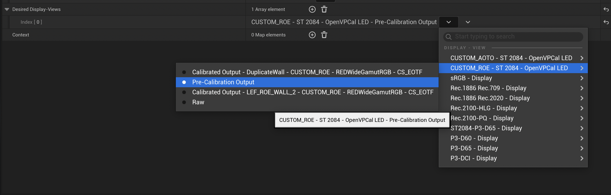

# OpenVPCal
OpenVPCal is an open source calibration tool for In-Camera Visual Effects pipelines. It is written in Python 3, and consists of a number of packages, for different levels of integration. \
Most users will utilize the precompiled application which consists of a PySide UI and CLI. \
 \
It creates a LED wall calibration, based on the observer camera in use. The calibration can be exported as an OpenColorIO Config and/or Display-to-Display 3D LUT, that should be applied to the content projected on the LED wall.

The full user guide for OpenVPCal can be found here [UserGuide](https://github.com/Netflix-Skunkworks/OpenVPCal/blob/main/User_Guide_OpenVPCal.pdf).

# Table of Contents

- [OpenVPCal](#openvpcal)
- [Contact Information](#contact-information)
- [Installation](#installation)
  - [Supported Platforms](#supported-platforms)
  - [Binaries](#binaries)
  - [From Source](#from-source)
  - [Developer Setup](#developer-setup)
  - [Why Not PyPi?](#why-not-pypi)
  - [Additional Requirements](#additional-requirements)
  - [Hardware Requirements](#hardware-requirements)
- [Quick Start Guide](#quick-start-guide)
- [User Guide](#user-guide)
  - [Basic Glossary](#basic-glossary)
  - [Create new project/Load existing project](#create-new-projectload-existing-project)
  - [Project Layout](#project-layout)
  - [Add Wall(s)](#add-walls)
  - [Patch Generation](#patch-generation)
  - [Camera / Lens Info](#camera--lens-info)
  - [Shoot](#shoot)
  - [Load and Set Calibration Plates](#load-and-set-calibration-plates)
  - [Analyse](#analyse)
  - [Analysis Validation](#analysis-validation)
  - [Analyse Layout](#analyse-layout)
  - [Calibration Settings Widget](#calibration-settings-widget)
  - [Calibration Matrix widget](#calibration-matrix-widget)
  - [IPT-DeltaE Analysis Widget](#ipt-deltae-analysis-widget)
  - [Calibrate](#calibrate)
  - [Calibration Use Cases](#calibration-use-cases) 
  - [Validation](#validation)
  - [SPG Test patterns](#spg-test-patterns)
- [Developer Guide](#developer-guide)
- [License](#license)
- [Changelog](#changelog)

# Contact Information

For any questions or issues with the beta, please submit issues on the github repository

# Installation

## Supported Platforms

Windows - :white_check_mark: \
OSX - :white_check_mark: \
Linux - :warning: (Supported But Untested)

## Binaries
For most users the easiest way to install OpenVPCal is to download the latest release from the [Release](https://github.com/Netflix-Skunkworks/OpenVPCal/releases/),
and download the pre built installer for your platform.

## From Source
#### Install Dependencies
Ensure the following dependencies are installed on your system:

    git
    git lfs
    Python-64-bit=3.11.6
    pkg-config
    autoconf
    automake
    autoconf-archive

OpenVPCal provides a system for building the following dependencies using vcpkg, however can be picked up from your existing studio
production or development environment.
    
    OpenImageIO=2.4.11    
    OpenColourIO=2.3.1

The following dependencies to OpenImageIO are critical to be included in its compilation:

    OpenEXR    
    freetype

#### Build From Source    
1. Clone the repository _(Note: Repo uses a large git lfs store, on windows, consider using GIT_LFS_SKIP_SMUDGE=1 to initially clone, and git lfs pull)_
2. Ensure you have the dependencies installed
3. run the "build.bat" or "build.sh" depending on your platform

This may take some time but the build script will perform the following:
1. Remove any existing virtual environments
2. Remove any existing distributions
3. Create a new virtual environment
4. Install the requirements from requirements.txt
5. Install vcpkg, compile and install the dependencies for OIIO
6. Build the executable for OpenVPCal and create the installer for the given platforms

### Developer Setup
Ensure the dependencies are installed and follow the steps below:
1. Add the src folder to the PYTHONPATH environment variable
2. Add the compiled dependencies to the PYTHONPATH with the platform specific replacements: 

    {VCPKG_ROOT}/vcpkg/installed/x64-{PLATFORM}/lib/python3.10/site-packages

3. (Optional) Alternatively if you already have a working environment feel free to use the paths from your existing
environment.

## Why Not PyPi?
OpenVPCal is not currently available on PyPi, this is due to the reliance on OpenImageIO and its many dependencies.
Once/If OpenImageIO is available on PyPi, OpenVPCal can easily be made available on PyPi.

Given there are many different ways studios manage their environments and compile their dependencies we leave this open 
but provide a simple way to build the application from source.

## Additional Requirements

* An image processing software to debayer or pre-process the plate and convert it to Linear EXRs (eg Assimilate, Davinci, Baselight, Colorfront, Mistika etc.)

## Hardware Requirements

* LED Panels (at least 4x4) or a Display
* Image Processor (for LED Panel)
* Media Playback system
* Camera (preferably capable of RAW recording) and a lens

# Quick Start Guide

Please use this guide for high-level instructions. For detailed information on the process, see the full User Guide below.

<table>
  <tr>
   <td colspan="2" ><strong><code>SETUP</code></strong>
   </td>
  </tr>
  <tr>
   <td><code>1. CREATE PROJECT</code>
   </td>
   <td>Open OpenVPCal and create a new project, select a new folder where the project files will live.
   </td>
  </tr>
  <tr>
   <td><code>2. SET UP TARGET LED WALL(s)</code>
   </td>
   <td>With “Add LED Wall”, create as many LED walls per camera as you need to calibrate. Use a naming convention that will make sense to recognise each wall correctly. In the “LED Settings” widget, set up the target walls’ settings according to the specs of your LED wall. 
   </td>
  </tr>
  <tr>
   <td><code>3. EXPORT CALIBRATION PATCHES</code>
   </td>
   <td>Export the calibration patches in the format of preference for your media player. You can change the default settings in the “Patch Generation” section, in the “Project Settings” widget. EXR files will be exported <strong>Linear at the Target Color Space </strong>(e.g. if you selected Rec2020 as target color space of the calibration, the EXR will be Linear Rec2020). Any other format will be exported as with the EOTF applied and in Target Color space (e.g. If you selected ST2084-Rec2020, the patches will be exported like that).
   </td>
  </tr>
  <tr>
   <td><code>4. LOAD PATCHES ON YOUR MEDIA PLAYER</code>
   </td>
   <td>Load the calibration patches on your media player, and <strong>bypass any color transform</strong>, as the calibration patches are already at the target color space. If you have exported EXRs, ensure only to apply the required EOTF transform, <strong>do not modify the color of the charts</strong>. Make sure the patches play correctly, with no frame blending or loop playback. 
   </td>
  </tr>
  <tr>
   <td><code>5. SET UP YOUR CAMERA</code>
   </td>
   <td>Set up the camera in front of the wall, and make sure both the wall and the camera are warmed up and at operating temperature. Switch off any part of the wall that is not in use or any additional light source in the stage.
   </td>
  </tr>
  <tr>
   <td><code>6. SHOOT PATCHES</code>
   </td>
   <td>Follow the instructions on the Start patch (the first patch of the sequence). Shoot more than 1 frame per patch. Check that the camera is well exposed and aligned to the wall. Shoot RAW where possible.
   </td>
  </tr>
  <tr>
   <td colspan="2" >CALIBRATE
   </td>
  </tr>
  <tr>
   <td><code>6. PRE-PROCESS PLATE</code>
   </td>
   <td>OpenVpCal only accepts Linear EXR as input: pre-process your camera plate to be either Linear/AP0 (ACES 2065-1) or Linear/Camera Native. We recommend Linear/AP0 (default for the tool).
   </td>
  </tr>
  <tr>
   <td><code>7. LOAD PLATE EXR SEQUENCE ON WALL</code>
   </td>
   <td>In OpenVpCal, right-click on the LED WALL and select “Load Plate Sequence”. Select the folder where the pre-processed camera plate is. 
   </td>
  </tr>
  <tr>
   <td><code>8. CHECK ROI and PATCH SEPARATION</code>
   </td>
   <td>OpenVpCal automatically detects the separation between frames and auto detects the ROI in the plate. Check that the ROI is correct and use the frame navigation buttons to check that the frame separation is accurate. 
   </td>
  </tr>
  <tr>
   <td><code>9. PLATE SETTINGS</code>
   </td>
   <td>In the “Plate Settings” widget, set up the “Plate Settings” and select the additional options you might require for your calibration. 
   </td>
  </tr>
  <tr>
   <td><code>10. ANALYSE </code>
   </td>
   <td>Click “Analyse” to allow the tool to perform an accurate analysis of your patches and derive the status of the wall. The tool will suggest whether the wall needs to be calibrated or not and will recommend calibration settings. You can analyse multiple walls at the same time.
   </td>
  </tr>
  <tr>
   <td><code>11. CHECK STATUS AND CALIBRATION SETTINGS</code>
   </td>
   <td>If the analysis is successful, check the patch swatches in the viewer to make sure that every frame is aligned (reference outside, plate inside). Analyse the plotting to determine if the suggested calibration recommendations are in line with your expectations. If the analysis wasn’t successful, reshoot the plates following the suggested corrections. 
   </td>
  </tr>
  <tr>
   <td><code>12. CALIBRATE</code>
   </td>
   <td>When happy to proceed, click “Calibrate”. You can always change the calibration settings and hit “Calibrate” again at any time. You can calibrate multiple walls at the same time.
   </td>
  </tr>
  <tr>
   <td><code>13. CHECK CALIBRATION</code>
   </td>
   <td>Check the results of the calibration by enabling “Preview Calibration” in the viewer. You should see a good improvement!
   </td>
  </tr>
  <tr>
   <td><code>14. EXPORT</code>
   </td>
   <td>If you are happy, export your calibration transforms by hitting the “Export” button. 
   </td>
  </tr>
</table>

# User Guide

This user guide only covers the use of OpenVPCal via the provided UI. A different developer guide is available for implementers who aim to integrate the Python API directly.

We provide a “Sample Project” for you to test the functionalities of the software. 

### Basic Glossary

There are a few terms used in this guide & in the UI which must be understood and correctly set. These colour spaces have different functions within the application: 

* **Reference**: the reference colour space in which every calculation is performed. For now, this is fixed to be ACES 2065-1.
* **Input**: the colour space in which the camera plate have been pre-processed in. This is default to ACES 2065-1.
* **Target**: the target colour space of the calibration
* **Screen**: the colour space of the screen/LED wall intended to be calibrated, as seen by the camera used to shoot the calibration patches
* **Camera Native**: the native color space of the camera used to capture the plates

#### Create new project/Load existing project

At the start of the application, the user can decide to “Create a New project” or “Load Existing Project”.

If selecting a new project, the user will be prompted to select a folder in which to save the project and its ancillary and export files. 

### Project Layout

Once the project is loaded, the application will automatically open the “Project Layout”.

A series of widgets and buttons are presented to the user:

##### STAGE VIEW

<table>
  <tr>
   <td colspan="2" ><strong><code>LED WALL BIN</code></strong>
   </td>
  </tr>
  <tr>
   <td><code>Add LED WALL </code>
   </td>
   <td>Add a new wall to the LED WALL BIN. A string text editor will pop-up to allow the user to input the LED WALL name
   </td>
  </tr>
  <tr>
   <td><code>REMOVE LED WALL</code>
   </td>
   <td>Remove the selected LED WALL from the LES WALL BIN
   </td>
  </tr>
  <tr>
   <td><code>(contextual menu) Add LED WALL </code>
   </td>
   <td>Same as above
   </td>
  </tr>
  <tr>
   <td><code>(contextual menu) Copy LED WALL </code>
   </td>
   <td>Copy the selected LED wall.  A string text editor will pop-up to allow the user to input the new LED WALL name.
   </td>
  </tr>
  <tr>
   <td><code>(contextual menu) Remove LED WALL </code>
   </td>
   <td>Same as above
   </td>
  </tr>
  <tr>
   <td><code>(contextual menu) Load Plate Sequence</code>
   </td>
   <td>Select a folder in which the pre-processed camera plate resides 
   </td>
  </tr>
  <tr>
   <td><code>(contextual menu) Add Verification Wall</code>
   </td>
   <td>Adds an led wall which is linked to the selected LED wall, allowing a sequence to be loaded after the calibration has been applied to assess the success 
   </td>
  </tr>
</table>

For information on the “Colour Space Analysis CIE Gamut” widget, please see below in the “Analyse”, “Diagnostic Widgets” section.  

##### IMAGE SELECTION

The image selection widget allows a viewer to the user to preview the calibration plate loaded for each wall. This widget allows the ability to select the ROI (Region of Interest) that the software will use to measure the values for each patch. The ROI is marked by a red rectangle that the user can drag and modify as required. Selecting the center of the ROI, allows it to be positionally dragged into place, whilst drag selecting the corners allows for resizing of the ROI. \
 \
Right clicking offers a context menu which resets the ROI should you make a mistake.

##### EXECUTION

<table>
  <tr>
   <td colspan="2" ><strong><code>ANALYSE, CALIBRATE, EXPORT ACTION BUTTONS</code></strong>
   </td>
  </tr>
  <tr>
   <td><code>ANALYSE</code>
   </td>
   <td>This action starts the analysis of the selected LED WALL(s)
   </td>
  </tr>
  <tr>
   <td><code>CALIBRATE</code>
   </td>
   <td>This action starts the calibration of the selected LED WALL(s)
   </td>
  </tr>
  <tr>
   <td><code>EXPORT</code>
   </td>
   <td>This action exports the calibration of the selected LED WALL(s)
   </td>
  </tr>
</table>

##### TIMELINE

<table>
  <tr>
   <td colspan="2" ><strong><code>NAVIGATION</code></strong>
   </td>
  </tr>
  <tr>
   <td><code>START FRAME</code>
   </td>
   <td>The first frame of the loaded plate sequence
   </td>
  </tr>
  <tr>
   <td><code>END FRAME</code>
   </td>
   <td>The last frame of the loaded plate sequence
   </td>
  </tr>
  <tr>
   <td><code>CURRENT FRAME</code>
   </td>
   <td>Current frame where the playhead is located on the plate sequence
   </td>
  </tr>
  <tr>
   <td><code>PLAYHEAD</code>
   </td>
   <td>The playhead to change the current frame
   </td>
  </tr>
  <tr>
   <td><code>GO TO START</code>
   </td>
   <td>A shortcut button to move the playhead to the start of the plate sequence
   </td>
  </tr>
  <tr>
   <td><code>PREVIOUS PATCH</code>
   </td>
   <td>A shortcut to move the playhead to the previous patch in the sequence
   </td>
  </tr>
  <tr>
   <td><code>PREVIOUS FRAME</code>
   </td>
   <td>A shortcut to move the playhead to the previous frame in the sequence
   </td>
  </tr>
  <tr>
   <td><code>NEXT FRAME</code>
   </td>
   <td>A shortcut to move the playhead to the next frame in the sequence
   </td>
  </tr>
  <tr>
   <td><code>NEXT PATCH</code>
   </td>
   <td>A shortcut to move the playhead to the next patch in the sequence
   </td>
  </tr>
  <tr>
   <td><code>GO TO END</code>
   </td>
   <td>A shortcut button to move the playhead to the end of the plate sequence
   </td>
  </tr>
</table>

##### LED SETTINGS

<table>
  <tr>
   <td colspan="2" ><strong><code>TARGET SPECS</code></strong>
   </td>
  </tr>
  <tr>
   <td><code>TARGET GAMUT</code>
   </td>
   <td>The target gamut for the calibration. Choose between predefined standard gamuts (sRGB, P3, Rec2020), or select a custom one that matches the LED wall primaries. 
   </td>
  </tr>
  <tr>
   <td><code>ADD CUSTOM GAMUT</code>
   </td>
   <td>A popup widget allows to add new custom gamut for the calibration by inserting a Custom gamut name and its CIE 1931 x,y primaries and white point coordinates 
   </td>
  </tr>
  <tr>
   <td><code>TARGET EOTF</code>
   </td>
   <td>Select the target EOTF of the LED panel.** Note that when switching between ST2084 to power gamma (sRGB/BT1886), the MaxLum will automatically reset. 
   </td>
  </tr>
  <tr>
   <td><code>TARGET MaxLum (nits)</code>
   </td>
   <td>Select the content peak luminance (only available if the EOTF is ST2084). 
   </td>
  </tr>
  <tr>
   <td><code>(in ADD CUSTOM GAMUT) CUSTOM NAME</code>
   </td>
   <td>Define the name of your custom target color space.
   </td>
  </tr>
  <tr>
   <td><code>(in ADD CUSTOM GAMUT) TARGET GAMUT CHROMATICITY COORDINATES</code>
   </td>
   <td>Review or modify the xy gamut primaries and the white point coordinates.
   </td>
  </tr>
  <tr>
   <td colspan="2" ><strong><code>TOOL SETTINGS</code></strong>
   </td>
  </tr>
  <tr>
   <td><code>NUMBER OF GREY PATCHES</code>
   </td>
   <td>The number of grey steps to be generated/analysed (default 33)
   </td>
  </tr>
  <tr>
   <td><code>PRIMARIES SATURATION</code>
   </td>
   <td>The saturation intensity for the colour primaries (default 0.7)
   </td>
  </tr>
</table>

##### PLATE SETTINGS

<table>
  <tr>
   <td colspan="2" ><strong><code>PLATE SETTINGS</code></strong>
   </td>
  </tr>
  <tr>
   <td><code>INPUT PLATE GAMUT</code>
   </td>
   <td>The Input colour space of the pre-processed camera plate sequence (default to ACES 2065-1)
   </td>
  </tr>
  <tr>
   <td><code>NATIVE CAMERA GAMUT</code>
   </td>
   <td>The native colour space of the camera used for the calibration
   </td>
  </tr>
  <tr>
   <td><code>AUTO WB SOURCE</code>
   </td>
   <td>If enabled, the input plate will be white-balanced prior to perform the analysis and calibration
   </td>
  </tr>
  <tr>
   <td colspan="2" ><strong><code>REFERENCE SETTINGS</code></strong>
   </td>
  </tr>
  <tr>
   <td><code>MATCH REFERENCE WALL</code>
   </td>
   <td>If checked, the selected LED wall will be matched to the selected reference wall
   </td>
  </tr>
  <tr>
   <td><code>REFERENCE WALL</code>
   </td>
   <td>A list of the available reference walls to match too
   </td>
  </tr>
  <tr>
   <td colspan="2" ><strong><code>USE EXTERNAL WHITE POINT</code></strong>
   </td>
  </tr>
  <tr>
   <td><code>USE EXTERNAL WHITE POINT</code>
   </td>
   <td>If checked, the plate original white point will be converted to the external white point prior to perform the analysis and the calibration 
   </td>
  </tr>
  <tr>
   <td><code>EXTERNAL WHITE POINT FILE</code>
   </td>
   <td>A path to a file with the external white point
   </td>
  </tr>
</table>

##### PROJECT SETTINGS

<table>
  <tr>
   <td colspan="2" ><strong><code>PROJECT SETTINGS</code></strong>
   </td>
  </tr>
  <tr>
   <td><code>OUTPUT FOLDER</code>
   </td>
   <td>Choose the location on disk to export files and save the project
   </td>
  </tr>
  <tr>
   <td><code>EXPORT LUT FOR ACESCCT</code>
   </td>
   <td>It modifies the calibration LUT export so that the LUT expects ACEScct input and produces a calibrated ACEScct output. The user will have to apply the color space conversion and EOTF  transform from ACEScct to Target independently  
   </td>
  </tr>
  <tr>
   <td><code>EXPORT LUT FOR ACESCCT IN / TARGET OUT</code>
   </td>
   <td>It modifies the calibration LUT export so that the LUT expects ACEScct input and produces a calibrated target output (with both the color space and EOTF transform to target applied). 
   </td>
  </tr>
  <tr>
   <td colspan="2" ><strong><code>PATCH GENERATION</code></strong>
   </td>
  </tr>
  <tr>
   <td><code>FILE FORMAT</code>
   </td>
   <td>Choose file format for export. If EXR is chosen, the patches will export in linear, scaled such that 1=100 nits. Otherwise, patches will export in the target space. 
   </td>
  </tr>
  <tr>
   <td><code>RESOLUTION WIDTH</code>
   </td>
   <td>Width resolution of the exported patches
   </td>
  </tr>
  <tr>
   <td><code>RESOLUTION HEIGHT</code>
   </td>
   <td>Height resolution of the exported patches
   </td>
  </tr>
  <tr>
   <td><code>FRAMES PER PATCH</code>
   </td>
   <td>How many frames per patches the tool will export
   </td>
  </tr>
  <tr>
   <td><code>CUSTOM LOGO</code>
   </td>
   <td>Use a user-defined logo to bake in the patches 
   </td>
  </tr>
</table>

### Add Wall(s)

In this first step, the user is required to add as many walls as required to be calibrated. The concept of a “wall” depends on the use case. Considering that the calibration process is linked to the combination of the physical LED wall and the camera in use (and potentially the lens in use, for certain use cases), users might have multiple walls that all refer to the same physical LED panel type but might aim to calibrate different cameras (eg. a LEDTypeA with Camera A is one wall; LEDTypeA with camera B becomes another wall). Similarly, as the tool offers the ability to perform different calibrations, a “wall” might be a specific calibration process (eg. with or without Gamut Compression enabled). 

The user can add a wall to the LED Wall Bin by clicking on “Add LED Wall”. 

The user is required to enter a name for the wall. Only alphanumeric characters are allowed.

Once the wall is created (in this example called “Wall1CamA”), it will appear in the Led Wall bin. 

At this point, for each wall added, the user is required to define the target parameters. These settings will also influence the calibration patch generation, so make sure to set them correctly before exporting the patches. Select **“Add Custom Gamut”** to define a target color space such as the LED wall primaries.

Once a wall is set up, the user can clone it via a contextual menu from the LED wall bin.

This feature is particularly useful when the user is required to calibrate the same wall with different cameras or different calibration pipelines.  

### Patch Generation

In order to generate the calibration, the user must first export calibration patches that can be played back on the Media Player of preference and shot with the camera of choice. Once all walls are created, the user can generate the calibration patches via “File>Generate OpenVpCal Patterns” 

Most of the color values of the calibration patches have absolute chromaticity (apart from the Macbeth chart) but require to be correctly encoded with the invEOTF that will be configured in the LED Wall image processor’s settings (Target Screen EOTF). **Therefore, the LED Settings in OpenVPCal must be correctly set up before exporting the calibration patches**. 

The user can set up the patch file format, resolution and number of frames per patch in the dedicated Patch Generation tab within the Project Settings widget. 

Choose the correct file format and encoding described in the Patch Generation section for the media playback system. For example, if Unreal is used, exporting the patches as linear EXRs might be easier. However, if using a system such as Disguise or Plate Performer, export display-referred patches as DPX files. 

Please note that if selecting EXR as File Format, the patch generation will ignore the EOTF and generate linear EXR patches, scaled so that the value of 1=100nits. These linear EXR are encoded in the Target Color space, so if you have selected Rec2020, the EXRs will be Linear Rec2020.

When exporting the patches, OpenVPCal will also export a Pre_Calibration_OpenVPCal.ocio config that provides the user with the necessary transforms to apply to the patches. This is fundamental when exporting EXR. 

The OCIO config will have a group of transforms called OpenVPCal, which will offer 3 color spaces:  \
1. An EOTF Curve only transform

2. A Color Space + EOTF

3. A linear Color Space 

As the EXRs are in Linear Color Space (e.g. Linear ROE_GAMUT, or Linear Rec2020), this is the Color space you should be selecting as Input color space in the OCIO configuration panel. 

Likewise, the OCIO config also offer an OpenVpCal group in the Display Color space called OpenVPCal PreCalibration. This will be your output color space in the OCIO configuration panel.

Here’s an example of how the OCIO configuration panel will look like with the transforms selected above. 

In case you have exported any other format than EXR, the Input and Output color space selected for your OCIO config should be identical=bypass.

In case your Media Playback cannot play each patch for a determined and consistent number of frames, set the “Frames per patch” option which will export the necessary frames to playback directly at your shooting FPS.

The user can also add a Custom Logo to the generation of the patches that will personalise the first Patch (Home patch) of the calibration sequence. 

### Camera / Lens Info

As OpenVPCal uses the camera as a colorimeter, best practice is to capture the calibration patches with the exact camera model that will be used in production. If that is not possible, any lens can be used for the calibration, but the camera model and its firmware should be the same. The calibration tool will minimize the effect of the lens on the patches. A “clean” prime lens with a medium focal length (35-65mm) is recommended.

### Shoot

#### Playback

Use the media playback system of choice for the calibration patch playback, given it meets the following requirements:

1. Connect to the LED Image Processor via the GPU
2. Playback at a consistent FPS
3. Enable transparency & customization for the color transform pipeline applied to the images
4. Only the necessary transforms are applied to the patches: the color of the patches should not be modified, hence only the required EOTF should be applied when using EXR patches, otherwise, the patches should not require any color transform at all. 
5. Bypass any OS color management (e.g. Windows ICC profiles) if using a non-standard Media Playback system (that should already bypass OS color management).

#### Patch Capture

Follow the instructions on the first generated patch “Home Patch” to ensure the best possible capture for the calibration process. **Please note that incorrect capture will result in invalid calibration results.** 

##### Capture Best Practices

###### LED Panels

* Turn off any part of the LED wall that is not directly in front of the camera and is required for the calibration. This is to avoid unnecessary flare.
* Warm up the camera and LED panels: display a flat grey color on the LED panels for at least 20/40 minutes before capture. It’s good practice to note down the physical temperature of the panel prior to shoot the calibration patches. Most Image Processors should be able to provide this information.   
* Set the LED panels to the maximum gain allowed by the Image processor calibration (do not override the gain).

###### Camera / Lens

* Set the camera as flat as possible to the wall, at a distance where it would be - on average - when shooting. Note that the distance from the camera and the wall should be so that the intensity of the light read from the wall into the camera doesn’t change anymore if the distance changes. Use a light meter to define the best distance or the camera’s false color (see below). 
* Use the first patch to make sure the camera is centered to the wall. The square must look like a square and the circle must look like a circle.
* Defocus in order to prevent moire. When defocusing, do it towards the camera (closer focus). Imagine that you need to focus on an actor that is sitting in front of the wall. Defocus should be JUST ENOUGH to make sure that the edge lines of the center square are blurred and blend with the edge of the center square. Too little will cause moire, too much might confuse the analysis.

Example Defocus

* Record multiple frames for each patch, the suggested amount is 10 each. When exporting the patches there is an option to export one frame per patch or multiple frames.
* Set the camera recording mode to RAW (if possible).
* Set the camera at the color temperature of choice. We suggest setting it to the white point of the LED wall (normally 65000Kelvin) or Auto white-balance the camera towards the center target gray square. This choice is important as it will generate different calibrations. For more information about the different use cases see below in the “Calibration Use cases'' section.  
* Set the exposure so that the center square hits 18% of the camera’s sensitivity. Use the camera's false color tool or a light meter to set the exposure until the whole square is set to 18% (e.g. the box becomes green on an Alexa, Red or Venice).  Use the 17% and 19% small patches at the bottom of the frame to make sure your exposure sits “in the middle”, as false colors can have quite of a broad range, relatively speaking. Ideally, use a t-stop that would be used on production. Otherwise, a good range is between T2>T5.6. ND filters might be required to hit that exposure. Preferably do not use shutter angle or camera FPS to adjust the exposure (it might create multiplexing issues). Get as close as possible to what will be used during production and/or is required for a correct genlock between the camera and the LED wall. If the distance between the wall and the camera is correct, moving the camera slightly closer or further away from the wall should not generate a drop/increase in the exposure (the false color should stay consistent). 

###### Playback/Processor

* If the sequence has only one frame per patch, play it with a frame rate equal to 1/10 of the camera recording's FPS: if the camera records at 25 FPS, set the playback to 2.5FPS.
* If the exact number of patches are available, the playback speed should be set at the camera FPS. 
* Disable any frame blending and playback loop, the sequence should stop at its last frame.
* Check the video data range (Legal/Full) throughout the pipeline. If a difference can be perceived between the four squares (image below), it is correctly set. Note that when in an ST2084 pipeline, the differences in the black might be slightly less perceivable than the ones in the white squares. 
* If the difference between squares is imperceptible, check the video pipeline from the media player to the wall (Media Player settings, GPU settings, Image processor settings) and make sure that the video range is set consistently throughout the pipeline. Don’t trust HDMI metadata, force all settings manually if possible.
* Scale the content until the center target gray square covers 60/70% of the vertical camera field of view

### Load and Set Calibration Plates

#### PreProcess Plate

Once the patches are captured, download the footage and load it into a DCC of preference. OpenVpCal only accepts Linear EXR as input: pre-process your camera plate to be either Linear/AP0 (ACES 2065-1) or Linear/Camera Native.  The plate should be therefore first converted or debayered directly to Linear ACES AP0 (ACES 2065-1) or Camera Native.

The default input for OpenVpCal is Linear ACES AP0 (ACES 2065-1). 

Plate sequences should follow the naming convention

_ &lt;FileName>.&lt;FramePadding>.&lt;FileExt>_

Eg calibration_sequence_wall-1.000001.exr

There are several DCCs that can be used for this scope. We are providing here a quick guide for Davinci Resolve.

1. Open Davinci Resolve and set a new project.
2. Go to project settings (the cog on the bottom right of the screen) and set the color science to ACES (ACES 1.3>, ACEScct, Gamut-Compression disabled). Leave the ACES output transform set to “No Output Transform”. If you shot RAW, you can leave the input transform set as “No Input Transform” as well, or select the required color space for your camera. If your camera is not on the list and Davinci cannot convert it to ACES automatically, you must source an IDT for your camera that allows you to convert your input color space to ACES 2065-1.

3. Load your calibration plate in a new timeline. Do not apply any color correction nor additional transforms to your plate.
4. Go to the delivery menu and, in the Video tab, set up your export as: EXR RGB Half. You can keep the camera native resolution or reduce it to HD. Make sure that the resizing quality is set to max in the Advanced Settings. 
5. In the File tab, select the Filename as Source Name. Add a Subfolder with the name of the clip by typing “%Clip Name” in the “File Subfolder” section.

6. Render the plate and load the resulting EXR in OpenVpCal. 

#### Load Plate

From the Stage View>Led Wall Bin you can now load your calibration plate associated with the LED wall it was shot for. 

Once selected the LED wall you want to load the plate for, right click on it and select “Load Plate Sequence”  or select from File>Load Plate Sequence.

OpenVpCal will automatically ingest the plate and attempt to determine which area of the calibration plate will be utilised for the analysis, the region of interest (ROI), and the separation between each patch (separation). Repeat this process for each LED wall that requires calibration.

Suppose OpenVPCal fails to determine the correct ROI. In that case, the user must use the first patch center square as a reference, and align the red ROI rectangle in the viewer: the reference square has some target crosses on the corners and a center target. This area should be sufficient for the analysis if the camera was set up correctly. 

#### Plate Settings

From the Plate Settings tab, you must set the color space of the Linear EXR file (e.g. ACES 2065-1), as well as the native color space of the camera used to capture the plate. 

If your workflow requires to auto-wb the plate and you could not perform this operation in camera, or you require a more accurate white balance, select Auto WB source.

Please refer to the “Common Use-cases” section to learn more about the different types of calibration workflows. 

<table>
  <tr>
   <td colspan="2" ><strong><code>PLATE SETTINGS</code></strong>
   </td>
  </tr>
  <tr>
   <td><code>INPUT PLATE GAMUT</code>
   </td>
   <td>The Input colour space of the pre-processed camera plate sequence (default to ACES 2065-1)
   </td>
  </tr>
  <tr>
   <td><code>NATIVE CAMERA GAMUT</code>
   </td>
   <td>The native colour space of the camera used for the calibration
   </td>
  </tr>
  <tr>
   <td><code>AUTO WB SOURCE</code>
   </td>
   <td>If enabled, the input plate will be white-balanced prior to perform the analysis and calibration
   </td>
  </tr>
</table>

### Analyse

Once the plates are loaded and set up for each LED wall that you intend to analyse and calibrate, you can hit Analyse in the Execution tab.

The analysis will extract the necessary information from the plate and switch the software configuration to the “Analysis layout”. You can select multiple walls at the same time and run the analysis simultaneously. \
 \
NOTE: Any walls which are using another wall as a reference must be analysed and calibrated at the same time

### Analysis Validation

Once the analysis is completed, the tool will prompt a pop-up window with a description of the results for each wall analysed. The analysis might issue some critical errors, warnings or a suggestion that the wall doesn’t require any calibration because it’s within a good tolerance. 

### Analyse Layout

#### Swatch Analysis

In the Analysis Layout, a Swatch Analysis viewer will appear to facilitate the user's appreciation of the status of the wall and its calibration. The viewer is run by OpenColor IO (OCIO) and therefore can map the swatches to any colour space available from the default OCIO config shipped with the tool, the ACES 1.3 Studio Config.  

The viewer plots each patch of the calibration sequence as a square swatch, in which the outer part shows the target color and the inner part shows the actual patch observed by the camera.  

The widget offers a series of tools:

<table>
  <tr>
   <td colspan="2" ><strong><code>SWATCH ANALYSIS VIEWER </code></strong>
   </td>
  </tr>
  <tr>
   <td><code>Exposure</code>
   </td>
   <td>A slider to change the exposure level of the swatches
   </td>
  </tr>
  <tr>
   <td><code>Display</code>
   </td>
   <td>A dropdown menu with all available OCIO DIsplays
   </td>
  </tr>
  <tr>
   <td><code>View</code>
   </td>
   <td>A dropdown menu with all the available OCIO Views for the selected Display 
   </td>
  </tr>
  <tr>
   <td><code>Apply White Balance Preview</code>
   </td>
   <td>Applies a preview of the Auto-WB and or External White Balance, if present
   </td>
  </tr>
  <tr>
   <td><code>Preview Calibration</code>
   </td>
   <td>The potential outcome of the calibration, digitally applied to the swatches to emulate what the results might be once the calibration is applied to the LED wall. Be mindful that this is just a simulation, and the results might differ. 
   </td>
  </tr>
</table>

#### Diagnostic widgets

A series of diagnostic widgets are presented to the user to help determine the status of the LED wall and its calibration. 

##### Max Distance Analysis

This widget shows the extent of the out-of-gamut colors measured in relation to the target color space of the calibration.

 

<table>
  <tr>
   <td colspan="2" ><strong><code>MAX DISTANCE ANALYSIS</code></strong>
   </td>
  </tr>
  <tr>
   <td><code>Pre-Cal</code>
   </td>
   <td>The results of the analysis, as measured directly from the calibration plate
   </td>
  </tr>
  <tr>
   <td><code>Post-Cal</code>
   </td>
   <td>The potential outcome of the calibration, digitally applied to the calibration plate to emulate what the results might be once the calibration is applied to the LED wall. Be mindful that this is just a simulation and the actual results might be different. 
   </td>
  </tr>
</table>

##### EOTF Analysis

This widget tracks the linear response of the LED wall.

<table>
  <tr>
   <td colspan="2" ><strong><code>EOTF ANALYSIS</code></strong>
   </td>
  </tr>
  <tr>
   <td><code>Pre-Cal</code>
   </td>
   <td>The results of the analysis, as measured directly from the calibration plate
   </td>
  </tr>
  <tr>
   <td><code>Post-Cal</code>
   </td>
   <td>The potential outcome of the calibration, digitally applied to the calibration plate to emulate what the results might be once the calibration is applied to the LED wall. Be mindful that this is just a simulation and the actual results might be different. 
   </td>
  </tr>
  <tr>
   <td><code>Red</code>
   </td>
   <td>Shows the Red channel data only
   </td>
  </tr>
  <tr>
   <td><code>Green</code>
   </td>
   <td>Shows the Green channel data only
   </td>
  </tr>
  <tr>
   <td><code>Blue</code>
   </td>
   <td>Shows the Blue channel data only
   </td>
  </tr>
</table>

##### White Point Analysis

This widget shows the observed white point of the LED wall, as seen by the camera. 

<table>
  <tr>
   <td colspan="2" ><strong><code>WHITE POINT ANALYSIS</code></strong>
   </td>
  </tr>
  <tr>
   <td><code>Target</code>
   </td>
   <td>Shows the ideal target of the calibration
   </td>
  </tr>
  <tr>
   <td><code>Pre-Cal</code>
   </td>
   <td>The results of the analysis, as measured directly from the calibration plate
   </td>
  </tr>
  <tr>
   <td><code>Post-Cal</code>
   </td>
   <td>The potential outcome of the calibration, digitally applied to the calibration plate to emulate what the results might be once the calibration is applied to the LED wall. Be mindful that this is just a simulation and the actual results might be different. 
   </td>
  </tr>
  <tr>
   <td><code>Macbeth</code>
   </td>
   <td>Adds to the plotting the Macbeth samples
   </td>
  </tr>
</table>

##### Colour Space Analysis

This widget shows the observed extent of the colour space and white point of the LED wall, as seen by the camera.

<table>
  <tr>
   <td colspan="2" ><strong><code>COLOUR SPACE ANALYSIS</code></strong>
   </td>
  </tr>
  <tr>
   <td><code>Target</code>
   </td>
   <td>Shows the ideal target of the calibration
   </td>
  </tr>
  <tr>
   <td><code>Pre-Cal</code>
   </td>
   <td>The results of the analysis, as measured directly from the calibration plate
   </td>
  </tr>
  <tr>
   <td><code>Post-Cal</code>
   </td>
   <td>The potential outcome of the calibration, digitally applied to the calibration plate to emulate what the results might be once the calibration is applied to the LED wall. Be mindful that this is just a simulation, and the results might differ. 
   </td>
  </tr>
  <tr>
   <td><code>Macbeth</code>
   </td>
   <td>Adds to the plotting the Macbeth samples
   </td>
  </tr>
</table>

### Calibration Settings Widget

The calibration settings offer a series of options that allow different calibration paths and functions. The analysis process should have already setup these parameters with the optimal ones required for your LED wall, but the user is free to choose what to enable/disable or what path to use. See the Calibration section for more information. 

<table>
  <tr>
   <td colspan="2" ><strong><code>CALIBRATION SETTINGS</code></strong>
   </td>
  </tr>
  <tr>
   <td><code>REFERENCE TO TARGET CAT</code>
   </td>
   <td>Choose from a standard list of Chromatic Adaptation Transforms or select NONE for the Reference to Target 3x3 matrix. Bradford is set as default
   </td>
  </tr>
  <tr>
   <td><code>CALCULATIONS ORDER</code>
   </td>
   <td>Edit the order of operations for the calibration transforms
   </td>
  </tr>
  <tr>
   <td><code>ENABLE EOTF CORRECTION</code>
   </td>
   <td>If checked, enable the EOTF correction
   </td>
  </tr>
  <tr>
   <td><code>TARGET TO SCREEN CAT</code>
   </td>
   <td>Choose from a standard list of Chromatic Adaptation Transforms or select NONE for the Calibration matrix. None is set as default.
   </td>
  </tr>
  <tr>
   <td><code>ENABLE GAMUT COMPRESSION</code>
   </td>
   <td>If checked, enable gamut compression
   </td>
  </tr>
  <tr>
   <td><code>AVOID CLIPPING</code>
   </td>
   <td>If checked, it scales the entire calibration transforms to avoid highlight clippings (on by default)
   </td>
  </tr>
</table>

## Calibration Matrix widget

Once the calibration is completed, this widget offers the option to copy each 3x3 matrix used in the calibration transforms in several practical formats. 

Available 3x3 Matrix:

* Target to Screen
* White Balance
* Reference to Target
* Reference to Screen
* Reference to Input
* Reference to XYZ
* E to D65

Available formats:

* Python
* Nuke
* CSV

<table>
  <tr>
   <td colspan="2" >
<strong><code>CALIBRATION MATRIX</code></strong>
   </td>
  </tr>
  <tr>
   <td><code>Matrix Dropdown</code>
   </td>
   <td>A list of the available matrices
   </td>
  </tr>
  <tr>
   <td><code>Format Option</code>
   </td>
   <td>A list of the available formats
   </td>
  </tr>
</table>

## IPT-DeltaE Analysis Widget

OpenVpCal tries to determine the status of the LED wall by using DeltaE IPT measurements, among other factors. This widget shows the measured IPT DeltaE between the reference target color and the one observed by the camera. It’s separated into groups of patches and offers the ability to select and compare multiple walls, estimating the “best wall” based on the average of deltaE measurements that fall under the just noticeable difference (JND) threshold. This feature is handy when comparing different calibration approaches or verifying a calibration's success against the wall's original status. 

## Calibrate

The calibration setup has multiple settings that determine how OpenVPCal will attempt to calibrate the LED wall(s). Here’s a more detailed description of what each does:

#### CALCULATION ORDER and EOTF CORRECTION

A specific note is required to clarify the Calculations order, which determines how OpenVpCal calculates the main elements of the calibration, the EOTF correction and the Target to Screen 3x3 Matrix. This choice is then reflected in the calibration files (OCIO or 3D LUTs)

. These options present three different paths: 

* EOTF CORRECTION DISABLED, the calibration will only be performed by a 3x3 matrix applied straight to the incoming RGB data converted to the Target color space. This approach assumes that the LED wall behaves linearly.
* 1D → 3x3, where the calibration process assumes that the LED wall doesn’t behave linearly. In this path, the non-linearity is assumed to happen at the end of the image processing chain (before the EOTF but after any color mapping within the LED chain). Hence the EOTF correction and RGB balancing are measured before the 3x3 calibration matrix
* 3x3 → 1D, where again, the calibration process assumes that the LED wall doesn’t behave linearly; however, in this case the non-linearity is assumed to happen at the beginning of the image processing chain (before or during the pipeline color mapping, before the EOTF). Therefore, the EOTF correction and RGB balancing are measured after the 3x3 calibration matrix.

Which one is the correct one? It depends: different pipelines might have different issues, however when the analysis process determines that the wall is not linear, the OpenVPCal default wil is the **1D>3x3** order.

##### CHROMATIC ADAPTATION TRANSFORM (CAT)

Chromatic Adaptation Transforms are designed to maintain the appearance of colors under different lighting conditions or white points. In order to assure the best possible calibration, OpenVPCal goes through a number of different conversions between color spaces and white points, this means a number of CAT transforms are applied forward and inverted within each block of the calibration transforms. Because mixing CAT within a set of transformations is bad practice, we provide the user only two places where to select different CATs, as these transform blocks are essentially independent of each other. Selecting NONE will bypass any Chromatic adaptation and will therefore modify the appearance of colors and white points when changing color space.  Depending on your workflow, different CATs may be appropriate. The OpenVPCal defaults are:

<table>
  <tr>
   <td><code>REFERENCE TO TARGET CAT</code>
   </td>
   <td>BRADFORD
   </td>
   <td>As we use ACES in OCIO as the default color framework, Bradford is the default CAT used for their output transforms, hence we adopted it as our default as well to map ACES to the target LED wall. 
   </td>
  </tr>
  <tr>
   <td><code>TARGET TO SCREEN CAT</code>
   </td>
   <td>NONE
   </td>
   <td>Because the ordinary scope of this transform is to alter the source  white point of the plate  to match the target of the calibration, the default is set to NONE.
   </td>
  </tr>
</table>

#### AVOID CLIPPING

The calibration might push one or two RGB channels above the intended peak luminance. When targeting ST2084 EOTF, if any of the channels go above then the display will clamp it, affecting the white point of the LED wall. Avoid clipping will push the channels to go below the peak luminance. It might affect the overall brightness of the wall, but it should be quite subtle, nevertheless.

### Calibration Use Cases

OpenVpCal offers a number of different options to calibrate an LED wall, based on different needs. The user can choose different paths within the calibration settings, but also perform things slightly differently according to the use case. Here’s a list of the most common ones:

##### SIMPLE CALIBRATION: Targeting A Specific White Point

This is the most common calibration use case, where the camera is set to a specific white balance setting. The calibration shifts the LED wall to ensure that the emitted white of the wall will result in white in camera with that specific camera setting. A good use case for this is to aim at the LED wall’s native white point (eg 6500K), or when the Cinematographer requires to shoot at a specific white balance and wants the wall to appear white with these parameters. 

For simplicity, we suggest setting the camera at the wall’s native white point so the calibration does not have to bake a huge white point shift. Instead, we recommend modifying the content’s colour temperature in the media player to look pleasing in the camera, leaving the camera and the calibration at the wall’s native white point. 

<table>
  <tr>
   <td colspan="2" ><strong><code>SIMPLE CALIBRATION</code></strong>
   </td>
  </tr>
  <tr>
   <td><code>Use case</code>
   </td>
   <td>Aim the calibration to the camera’s specific white point
   </td>
  </tr>
  <tr>
   <td><code>Pros</code>
   </td>
   <td>Simple, moves the content’s color temperature problem to the media player
   </td>
  </tr>
  <tr>
   <td><code>Cons</code>
   </td>
   <td>The effect of the lens on the calibration is baked in the calibration, so it might be required to run different calibrations for different lenses
   </td>
  </tr>
</table>

##### AUTO WHITE BALANCE CALIBRATION: A shortcut to remove the lens effect

In this use case, we ask to perform an auto white-balance in the camera on the first patch of the calibration sequence, prior to shoot the plate (or to the plate, if the camera does not allow to auto-white balance, using the AUTO-WB option in the PLATE SETTINGS widget, when loading the calibration plate). The calibration will not change the white point of the wall. It will only adjust the color mapping, the EOTF balancing (if enabled) and the out of gamut colors (if enabled). This calibration is less subject to potential color shifts created by the lenses used to shoot, but it will not address the camera’s metameric failure of the white point, forcing the cinematographer to shoot at a specific white point setting (suggested by the auto-white balance in camera) or always to adjust the in-camera white point to obtain the intended result.

<table>
  <tr>
   <td colspan="2" ><strong><code>AUTO WB CALIBRATION</code></strong>
   </td>
  </tr>
  <tr>
   <td><code>Use case</code>
   </td>
   <td>The calibration won’t shift the WALL white point, only corrects colour and EOTF
   </td>
  </tr>
  <tr>
   <td><code>Pros</code>
   </td>
   <td>Simple, more solid with lens color shits
   </td>
  </tr>
  <tr>
   <td><code>Cons</code>
   </td>
   <td>The effect of the lens on the calibration is bypassed by the white balance, but the metameric failure of the camera against the wall isn’t fixed as the auto-white-balance fixes that too. 
   </td>
  </tr>
</table>

##### MATCH WALL CALIBRATION: Shiting the calibration to make multiple walls match

When your stage has multiple LED wall types (brands/models) and you want to match them in camera, this workflow allows you to select a “reference wall” that is used as main target for the calibration. By enabling “Match Reference Wall” and selecting from the dropdown menu one of the other walls from the Stage View Bin, OpenVpCal will make sure that the wall you are calibrating will match the Reference one when keeping the camera at the same white balance. The Reference wall can follow any of the other workflows (Simple, Auto-WB and External White), and these shifts will be handed along to the matching wall(s). 

##### EXTERNAL WHITE BALANCE CALIBRATION: Decoupling lenses or shifting to external white points

Like the auto-wb option, this option allows to correct the plate prior to be passed to the analysis. 

However, in this case the calibration plate is white balanced towards an external white point, instead of the target white point. There are different use cases for this workflow, but it has mostly been designed to decouple the effect of the lens used to shoot the calibration plate. When enabeling this option, OpenVpCal requires the user to select a frame from which it will calculate the white balance matrix to apply to the calibration patches. When aiming to decouple the effect of the lens, we perform the workflow in these simple steps:

1. Shoot the calibration patches as per **<code>SIMPLE CALIBRATION</code></strong> workflow, setting the camera to the LED wall white point. Once finish to shoot, roll back the sequence to the first frame, where the grey square and circle are;
2. Remove the lens from the camera, don’t change anything else;
3. The incoming light from the LED wall to the sensor will be bright without a lens, so change the shutter speed and/or fps of the camera to make sure that the blurred image doesn’t clip. Ideally it should be exposed correctly (using the false color of the camera, should get to the 18% level). 
4. Shoot just a second (a single frame is necessary) of the first patch of the calibration sequence only. You don’t need to run the entire sequence. 
5. Use one frame of the clip shot without a lens as External White Point File

<table>
  <tr>
   <td colspan="2" >
<strong><code>EXTERNAL WHITE BALANCE CALIBRATION CALIBRATION</code></strong>
   </td>
  </tr>
  <tr>
   <td><code>Use case</code>
   </td>
   <td>The calibration aims to a specific white point, removing the effect of the lens 
   </td>
  </tr>
  <tr>
   <td><code>Pros</code>
   </td>
   <td>More advanced, solves multiple challenges at once, it does not depend on the lens used
   </td>
  </tr>
  <tr>
   <td><code>Cons</code>
   </td>
   <td>It require to shoot additional plates without the lens and its prone to more errors
   </td>
  </tr>
</table>

Once applied, the gray patches on the right hand of the viewer will show the before and after the external white point shift calibration. 

#### EXPORT CALIBRATION

The calibration is complete! The final step is to export the transforms. OpenVPCal uses OCIO as the primary format for the export. Clicking on the EXPORT button prompts the user whether to use the default OCIO config or one they provide.

The OCIO config file will be saved in the calibration folder within the exports folder of the project. Named Post_Calibration_OpenVPCal.ocio, and contains the calibration transforms as new Displays and Views. The OCIO config will embed transforms for each LED wall if multiple walls were calibrated. 

As per the Pre-Calibration config, the OCIO config exported from the calibration will offer color spaces under the OpenVpCal group. You can now choose the calibrated LED wall in the Display color spaces under this naming convention: 

OpenVPCal [WALL_NAME] - [CAMERA NATIVE GAMUT]

Example: OpenVPCal ROE - REDWideGamutRGB

The 3D LUT exported by OpenVPCal is normally a display-to-display LUT. However, in the project settings widget, the user can select to export the LUT in a different format as an ACEScct in/out or ACEScct in and Display Target Out.

### Validation

Once the calibration is completed and exported, we suggest validating it by re-shooting the original plate on the wall with the calibration transforms applied. OpenVpCal offers the ability to  “Add Validation Wall”, that allows the user to compare the status of the wall prior and post calibration.

Once loading the verification wall plates, run the Analysis. OpenVpCal will essentially consider the verification wall as a slave wall of its source; hence, it will copy all the target settings and show itl as an additional wall in the Stage View bin. 

If successful, the analysis of the validation wall should report that the verification wall needs no calibration, and the IPT DeltaE analysis should show primarily green/yellow colours and better JND values than the source wall before its calibration.

  

### SPG Test patterns

OpenVpCal is shipped with a version of the synthetic pattern generator for ICVFX tool (SPG). 
From File>Generate SPG Patterns, the images are generated in the same color space and eotf as the led wall.

The user can export a series of reference images that can be used to verify and debug 
the image chain from the media player to the LED wall and use this prior to running a calibration to ensure that the 
whole chain is correct and performing as expected.

These patterns should be judged via the camera output primarily however some patterns exhibit problems to the naked eye.

The default sequence will contain the following patterns:

* **Frame Syc Count** - When filmed through the camera lens, should display whole numbers on each frame of the recording
if any ghosting/blending of numbers is present there is a sync or playback issue. 

* **Checkerboard** - A simple checkerboard pattern to check for any scaling or aspect ratio issues.
* **Linear Steps** - A series of linear steps in absolute brightness in nits, when working in PQ (ST2084). There should be clearly visible bands up to the peak luminance of the wall, and no further visible walls.
If there are more or less bands either above or below the peak of the wall there is a configuration issue.
* **Exposure Stops** - A series of exposure stops, when displayed on the calibrated wall, by exposing the camera using the false color of the 
camera, moving up and down a stop of exposure either of the content of the media server or via the camera itself, will highlight each exposure stop on the wall confirming a linear lighting response
* **Data Range (legal/extended)** - Ensures that the imaging chain is extended range not being limited by a legal range. 
* **Bit Depth** - A grey ramp denoting every code value from 0-1023 in 10 bit, any banding indicates the imaging chain is not 10 bit. 
* **Color Steps** - A series of color steps to indicate any color clipping issues, similar to the Linear Steps 
there should be nice even steps with no black bands or indistinguishable bands 
* **Real Black Level** - Displays the bottom 18% of code values displayable on the LED panel, different this helps determine where 
the minimal black level the LED panels are capable of before multiplexing issues are introduced to the camera.
* **Alignment** - A series of grids and cross patterns which ensures there are no mis alignments in physical 
construction or mapping of content to the led wall 

## Developer Guide
## License

### Changelog

<table>
  <tr>
   <td colspan="2" ><strong><code>CHANGELOG</code></strong>
   </td>
  </tr>
  <tr>
   <td>
   </td>
   <td>Added new userguide for exporting EXR from Davinci and setting up OCIO
   </td>
  </tr>
  <tr>
   <td>
   </td>
   <td>New User guide for V1 released
   </td>
  </tr>
  <tr>
   <td>
   </td>
   <td>
   </td>
  </tr>
</table>

